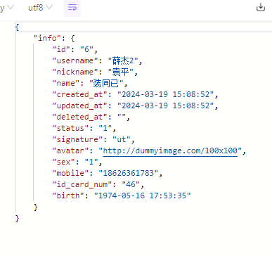

## github.com/jmattheis/goverter
简单的说一下这个库的使用方法吧
```
go install github.com/jmattheis/goverter/cmd/goverter@latest
```
在common文件夹下建立convert文件夹

extendFunc.go
```
package convert  
  
import (  
    "database/sql"  
    "time")  
  
func SQLStringToPString(value sql.NullString) string {  
    if value.Valid {  
       return value.String  
    }  
    return ""  
}  
func Int64To32(i int64) int32 {  
    return int32(i)  
}  
func SQLTimeToString(t time.Time) string {  
    return t.Format(time.DateTime)  
}  
func SQLNullTimeToString(t sql.NullTime) string {  
    if t.Valid {  
       return t.Time.Format(time.DateTime)  
    }  
    return ""  
}  
func SQLNullInt64ToInt64(i sql.NullInt64) int64 {  
    if i.Valid {  
       return i.Int64  
    }  
    return 0  
}  
func SQLNullFloat64ToFloat64(i sql.NullFloat64) float64 {  
    if i.Valid {  
       return i.Float64  
    }  
    return 0  
}
```
方法都挺简单的  随便看看就好了 就是一些数据的转换  接下来会用到

convert.go
```
package convert  
  
import (  
    "EasyGo/services/model/usermodel"  
    "EasyGo/services/rpc/user/userRpcModel")  
  
// goverter:converter  
// goverter:matchIgnoreCase  
// goverter:extend SQLStringToPString  
// goverter:extend Int64To32  
// goverter:extend SQLTimeToString  
// goverter:extend SQLNullTimeToString  
// goverter:extend SQLNullInt64ToInt64  
// goverter:extend SQLNullFloat64ToFloat64  
type Converter interface {  
    // goverter:ignore state  
    // goverter:ignore sizeCache    
    // goverter:ignore unknownFields    
    UserS2R(source *usermodel.Users) *userRpcModel.User  
    //请在以下加其他的转换方法  
    UsersS2R(source []*usermodel.Users) []*userRpcModel.User  
}
```

接着执行
```
goverter ./
```
就可以看到自动生成了方法

==在common文件夹下新建convert.go==
```
package common  
  
import "EasyGo/common/convert/generated"  
  
var Convert = generated.ConverterImpl{}
```

不能在convert文件夹下面新建  截止到2024.3.19为止  会出现循环引用的问题


接着在rpc中调用方法即可
```
func (l *GetUserByIdLogic) GetUserById(in *userRpcModel.ReqId) (*userRpcModel.ResUser, error) {  
    one, err := l.svcCtx.UserModel.FindOne(l.ctx, in.Id)  
    if err != nil {  
       return nil, err  
    }  
    return &userRpcModel.ResUser{  
       Info: common.Convert.UserS2R(one),  
    }, nil  
}
```



剩下的CreateUser   UpdateUser调用model层的insert  update方法即可
user_auths表也是照葫芦画瓢就可以了
就不再过多赘述了